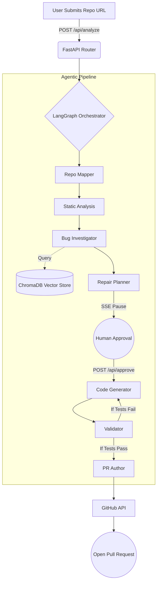

<div align="center">
  
  <h1>CodeSentinel</h1>
  <p><strong>Autonomous AI Code Review & Remediation</strong></p>
  <p><em>Don't just find vulnerabilities. Fix them.</em></p>
</div>

---

## 📖 Overview

**CodeSentinel** is a production-grade, multi-agent AI system that shifts application security from reactive alerting to proactive remediation. Instead of drowning engineering teams in static analysis alerts, CodeSentinel automatically clones repositories, detects bugs via deterministic SAST tools, investigates root causes using LLMs, generates standard unified diffs, runs local test suites to validate patches, and opens a Pull Request with the fix.

## 🚀 Tech Stack & Justifications

### Backend
- **Python 3.10+ & FastAPI:** Chosen for its asynchronous speed, native Pydantic validation, and excellent support for Server-Sent Events (SSE).
- **LangGraph:** Provides a robust Directed Acyclic Graph (DAG) state machine for orchestrating multiple discrete AI agents, enabling cyclic loops (e.g., test -> fail -> fix -> test).
- **ChromaDB:** A lightweight embedded vector database used to store and semantically retrieve past validated fixes to improve LLM context via RAG.
- **Groq API:** Utilized for sub-second LLM inference latency. Multi-tier routing sends simple tasks to smaller models and complex code generation to 70B+ parameter models.

### Frontend
- **React 18 & Vite:** Lightning-fast HMR and optimized production builds.
- **Tailwind CSS:** Utility-first CSS for rapid, highly-customizable responsive design.
- **Context API & Custom Hooks:** Cleanly decouples SSE streaming state and asynchronous HTTP mutations from the component tree.

### Tooling
- **SAST Runners:** Integrates `Semgrep`, `Bandit`, `Flake8`, `Pylint`, and `ESLint` as the deterministic baseline for bug detection.
- **PyGithub:** Safely abstracts cross-fork Pull Request creation and branch management.

---

## 📂 Folder & File Structure

```text
codesentinel/
├── backend/
│   ├── main.py                  # FastAPI entry point & static asset mounter
│   ├── orchestrator.py          # LangGraph state machine & event queues
│   ├── config.py                # Environment & LLM key rotation pool
│   ├── api/
│   │   ├── routes.py            # POST endpoints (analysis initiation, approvals)
│   │   └── sse.py               # SSE streaming endpoint for pipeline observability
│   ├── agents/                  # LangGraph Node Actors
│   │   ├── repo_mapper.py       # Builds AST knowledge graph of target repo
│   │   ├── static_analysis.py   # Subprocess orchestration for SAST tools
│   │   ├── bug_investigator.py  # LLM RAG root-cause analysis
│   │   ├── repair_planner.py    # Formulates fixes & requests human approval
│   │   ├── code_generator.py    # Generates standard unified diffs
│   │   ├── validator.py         # Dynamic test suite execution & retry loops
│   │   └── pr_author.py         # Pull Request synthesizer
│   ├── models/
│   │   └── pipeline_state.py    # Strictly typed state schema via NotRequired TypedDict
│   ├── tools/
│   │   ├── patch_applier.py     # OS-level unified diff validation & application
│   │   ├── github_client.py     # PyGithub abstraction layer
│   │   └── prompt_cache.py      # Version-controlled system prompts
│   └── admin_dashboard/         # Isolated Vite/React app for Token Observability
└── frontend/
    ├── src/
    │   ├── context/
    │   │   └── PipelineContext.jsx # Global Reducer for SSE event payloads
    │   ├── hooks/
    │   │   ├── usePipeline.js   # SSE connection management & auto-retry
    │   │   └── useApproval.js   # Async mutation hook for human intervention
    │   ├── components/          # Reusable UI components (DiffViewer, PipelineView)
    │   └── App.jsx              # Main UI Shell
    └── vite.config.js           # API proxy configuration
```

---

## ⚙️ Architecture Data Flow



---

## 🛠️ Local Setup Instructions

### 1. Prerequisites
- Python 3.10+
- Node.js 18+
- Git, `patch` utility, and standard SAST tools (`semgrep`, `bandit`, `flake8`, `pylint`, `eslint`).

### 2. Clone & Backend Setup
```bash
git clone https://github.com/yourusername/codesentinel.git
cd codesentinel/backend

python -m venv venv
source venv/bin/activate  # On Windows: venv\Scripts\activate
pip install -r requirements.txt
```

### 3. Frontend Setup
```bash
cd ../frontend
npm install
```

### 4. Admin Dashboard Setup (Required for /admin route)
```bash
cd ../backend/admin_dashboard
npm install
npm run build
```

### 5. Environment Variables
Create a `.env` file in the `backend/` directory:
```env
# Required: Array of Groq API keys for automated round-robin rotation
GROQ_API_KEYS=["gsk_abc123", "gsk_def456"]

# Required: For cloning, pushing, and opening PRs
GITHUB_TOKEN=ghp_your_personal_access_token

# Required: Master password to access the /admin observability dashboard
ADMIN_SECRET=your_super_secret_password
```

### 6. Run the Application
Start the Backend (Terminal 1):
```bash
cd backend
python main.py
# Runs Uvicorn on http://localhost:8000
```

Start the Frontend (Terminal 2):
```bash
cd frontend
npm run dev
# Runs Vite on http://localhost:5173
```

Navigate to `http://localhost:5173` to use the app.

---

## 🔌 API Endpoints

| Method | Endpoint | Description |
|--------|----------|-------------|
| `POST` | `/api/analyze` | Initiates the pipeline for a given `repo_url`. |
| `GET`  | `/api/stream` | SSE endpoint streaming real-time `PipelineState` payloads. |
| `POST` | `/api/approve/{task_id}` | Unblocks the LangGraph pipeline with a human `approved` or `rejected` decision. |
| `GET`  | `/admin/token-usage` | Protected endpoint returning LLM key rotation stats. Requires `X-Admin-Token` header. |
| `GET`  | `/admin` | Serves the statically built React Admin Dashboard. |

---

## 🔒 Security Considerations

1. **Prompt Injection Prevention:** The `patch_applier.py` strictly validates the presence of `---`, `+++`, and `@@` standard diff markers before passing any LLM output to the system `patch` command.
2. **Ephemeral Sandboxing:** The pipeline operates on temporary Git branches (`agent/fix-*`). Local file modifications are completely discarded if validation loops hit the maximum retry limit.
3. **Secret Management:** LLM API keys and GitHub tokens are strictly confined to the backend environment and never exposed via SSE payloads.

---

## 🚀 Deployment

1. **Backend:** Deploy via Docker using `gunicorn` with `uvicorn.workers.UvicornWorker`. Ensure the host has the necessary SAST binaries installed in the `$PATH`.
2. **Frontend:** Build the frontend (`npm run build`) and serve the `/dist` directory via an Nginx reverse proxy, CDN, or directly via FastAPI's `StaticFiles` mounter.
3. **Admin Dashboard:** Ensure `backend/admin_dashboard/dist` is built prior to backend startup, as FastAPI mounts this directory at boot.

---

## 🤝 Contribution Guide
1. Fork the repository.
2. Create a feature branch: `git checkout -b feature/your-feature-name`.
3. Ensure type safety using `mypy` against the strictly typed `PipelineState` schema.
4. Submit a Pull Request describing your changes and link any relevant issues.

<div align="center">
  <p>Built with ❤️ for autonomous software engineering.</p>
</div>
