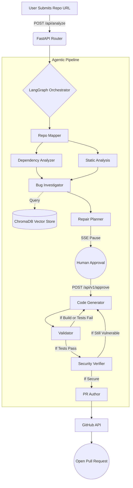

<div align="center">
  <br />
  <a href="https://github.com/yourusername/codesentinel" style="display: flex; justify-content: center; align-items: center; gap: 20px; text-decoration: none;">
    
    
  </a>
  <br />
</div>

---

## Problem Statement

### Alert Fatigue Is Killing Your Codebase

Today's modern CI/CD pipelines are exceptional at finding problems and almost useless at solving them. Every commit triggers a fresh wave of SAST warnings, dependency CVEs, and lint failures that pile up faster than any team can review them. Developers stop reading the alerts. Security debt compounds quietly in the background until it becomes a breach.

**This leads to:**
- Backlogs of unresolved vulnerabilities that nobody has time to investigate.
- Critical fixes delayed for weeks because triage requires deep repo context.
- Inconsistent patches when different engineers fix the same class of bug differently.
- Growing distance between detection tooling and the people who can actually act on it.

---

## Solution

> The problem isn't that scanners don't find the bugs.
> It's that finding a bug and fixing it correctly are two completely different jobs.

**CodeSentinel** is an autonomous agent mesh that closes that gap. It does not just flag issues, it reads your repository like an engineer would, plans a fix, writes the patch, tests it, re-scans it for the original vulnerability, and opens a pull request ready for human review.

Instead of adding another dashboard of red warnings, CodeSentinel turns those warnings into shipped code.

---

## Tech Stack & Architecture

### Backend
- **Python 3.10+ & FastAPI:** Asynchronous speed, Pydantic validation, and Server-Sent Events (SSE). Utilizes `fastapi.BackgroundTasks` to execute headless pipelines suitable for robust CI/CD webhook triggers.
- **LangGraph:** Robust Directed Acyclic Graph (DAG) state machine orchestrating discrete AI agents, enabling cyclic validation loops (test -> fail -> fix -> test).
- **ChromaDB:** Lightweight embedded vector database storing and retrieving past validated fixes via RAG.
- **Groq API:** Multi-tier routing sending simple tasks to rapid models and complex code generation to 70B+ parameters.

### Frontend
- **React 18 & Vite:** Lightning-fast HMR and optimized production builds.
- **Tailwind CSS:** Utility-first CSS for rapid, highly-customizable responsive design.
- **Context API & Custom Hooks:** Decouples SSE streaming state and asynchronous HTTP mutations.

### Tooling
- **SAST Runners:** `Semgrep`, `Bandit`, `Flake8`, `Pylint`, and `ESLint` serve as the deterministic baseline. Also includes real-time OSV, NPM, and PyPI public registry checks.
- **PyGithub:** Safely abstracts cross-fork Pull Request creation and branch management.
- **Pure Python Patch Engine:** A custom-built Search/Replace engine that bypasses strict `git apply` constraints to guarantee reliable AI code insertion.

---

## Data Flow



---

## Local Setup Instructions

### 1. Prerequisites
- Python 3.10+
- Node.js 18+
- Git and standard SAST tools (`semgrep`, `bandit`, `flake8`, `pylint`, `eslint`).

### 2. Clone & Backend Setup
```bash
git clone https://github.com/yourusername/codesentinel.git
cd codesentinel/backend

python -m venv venv
source venv/bin/activate  # On Windows: venv\Scripts\activate
pip install -r requirements.txt
```

### 3. Frontend Setup
```bash
cd ../frontend
npm install
```

### 4. Admin Dashboard Setup (Required for /admin route)
```bash
cd ../backend/admin_dashboard
npm install
npm run build
```

### 5. Environment Variables
Create a `.env` file in the `backend/` directory:
```env
# Required: Array of Groq API keys for automated round-robin rotation
GROQ_API_KEYS=["gsk_abc123", "gsk_def456"]

# Required: For cloning, pushing, and opening PRs
GITHUB_TOKEN=ghp_your_personal_access_token

# Required: Master password to access the /admin observability dashboard
ADMIN_SECRET=your_super_secret_password
```

### 6. Run the Application
**Start the Backend (Terminal 1):**
```bash
cd backend
python main.py
# Runs Uvicorn on http://localhost:8000
```

**Start the Frontend (Terminal 2):**
```bash
cd frontend
npm run dev
# Runs Vite on http://localhost:5173
```

Navigate to `http://localhost:5173` to use the app.

---

## 🔌 API Endpoints

| Method | Endpoint | Description |
|--------|----------|-------------|
| `POST` | `/api/v1/analyze` | Initiates the headless pipeline for a given `repo_url` (or a wildcard list of repos), returning a unique UUID `task_id` without blocking the HTTP response. |
| `GET`  | `/api/stream` | SSE endpoint streaming real-time `PipelineState` payloads, filterable by `task_id`. |
| `POST` | `/api/v1/approve/{task_id}` | Unblocks the LangGraph pipeline with a human `approved` or `rejected` decision. |
| `GET`  | `/admin/token-usage` | Protected endpoint returning LLM key rotation stats. Requires `X-Admin-Token` header. |
| `GET`  | `/admin` | Serves the statically built React Admin Dashboard. |

---

## 🤖 CI/CD Integration (GitHub Actions)

CodeSentinel comes with a pre-configured GitHub Actions workflow template located in `ci-cd-template/.github/workflows/codesentinel.yml`.

By copying this workflow into your target repository, you can automatically trigger the CodeSentinel pipeline whenever a Pull Request is opened or a push lands on `main`.

**Setup Instructions:**
1. Navigate to your target repository on GitHub.
2. Go to **Settings** -> **Secrets and variables** -> **Actions** -> **New repository secret**.
3. Name the secret `CODESENTINEL_API_URL` and set the value to the public URL of your deployed CodeSentinel backend (e.g., `https://api.codesentinel.yourdomain.com`).
4. Copy the `codesentinel.yml` file into your repository's `.github/workflows/` directory.

Once configured, CodeSentinel will automatically analyze incoming code and post a comment directly on your PRs with a link to the live SSE telemetry stream!

---

## Security Considerations

1. **Deterministic Patching:** The custom Python patch engine ensures exactly what the AI suggests is applied, bypassing brittle system patch limits while maintaining strict character matching and forbidding LLM abbreviations.
2. **Ephemeral Sandboxing:** The pipeline operates on temporary Git branches (`agent/fix-*`). Local file modifications are completely discarded if validation loops hit the maximum retry limit.
3. **Secret Management:** LLM API keys and GitHub tokens are strictly confined to the backend environment and never exposed via SSE payloads.

---

## Project Structure

```text
codesentinel/
├── backend/
│   ├── main.py                  # FastAPI entry point & static asset mounter
│   ├── state.py                 # Global state and SSE queues
│   ├── orchestrator.py          # LangGraph state machine
│   ├── config.py                # Environment & LLM key rotation pool
│   ├── api/
│   │   ├── routes.py            # POST endpoints (analysis initiation, approvals)
│   │   └── sse.py               # SSE streaming endpoint for pipeline observability
│   ├── agents/                  # LangGraph Node Actors
│   │   ├── repo_mapper.py       # Builds LLM architectural map of target repo
│   │   ├── dependency_analyzer.py # Identifies outdated packages and CVEs
│   │   ├── static_analysis.py   # Subprocess orchestration for SAST tools
│   │   ├── bug_investigator.py  # LLM RAG root-cause analysis
│   │   ├── repair_planner.py    # Formulates fixes & requests human approval
│   │   ├── code_generator.py    # Generates Search/Replace blocks
│   │   ├── validator.py         # Dynamic test suite execution & retry loops
│   │   ├── security_verifier.py # Re-runs SAST to verify vulnerabilities are fixed
│   │   └── pr_author.py         # Pull Request synthesizer
│   ├── models/
│   │   └── pipeline_state.py    # Strictly typed state schema
│   ├── tools/
│   │   ├── patch_applier.py     # Pure Python search & replace patch engine
│   │   ├── github_client.py     # PyGithub abstraction layer
│   │   └── prompt_cache.py      # Version-controlled system prompts
│   └── admin_dashboard/         # Isolated Vite/React app for Token Observability
├── ci-cd-template/              # Drop-in automation scripts for target repos
│   └── .github/workflows/       
│       └── codesentinel.yml     # GitHub Actions CI/CD trigger workflow
└── frontend/
    ├── src/
    │   ├── context/
    │   │   └── PipelineContext.jsx # Global Reducer for SSE event payloads
    │   ├── hooks/
    │   │   ├── usePipeline.js   # SSE connection management & auto-retry
    │   │   └── useApproval.js   # Async mutation hook for human intervention
    │   ├── components/          # Reusable UI components (DiffViewer, PipelineView)
    │   └── App.jsx              # Main UI Shell
    └── vite.config.js           # API proxy configuration
```
